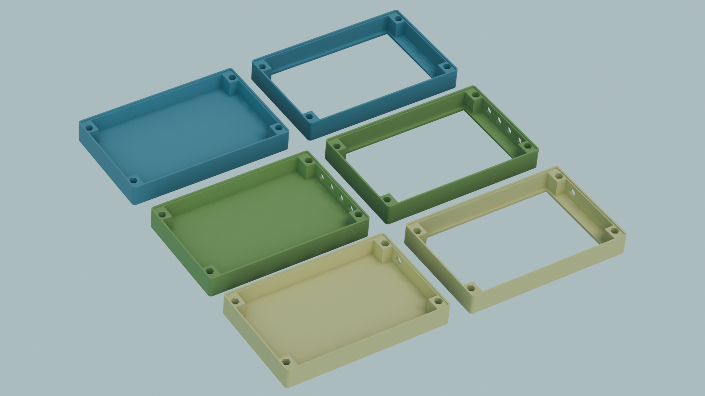
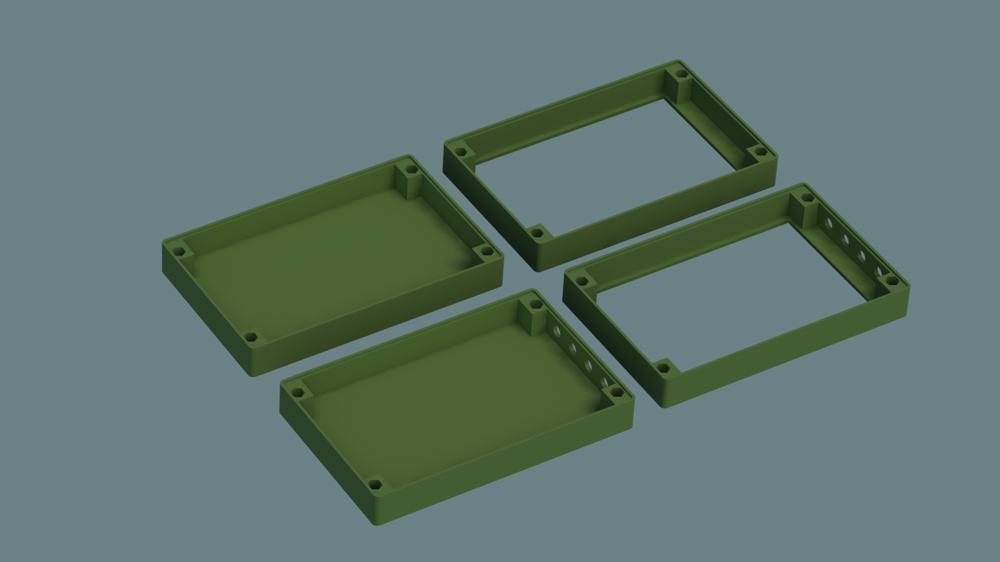
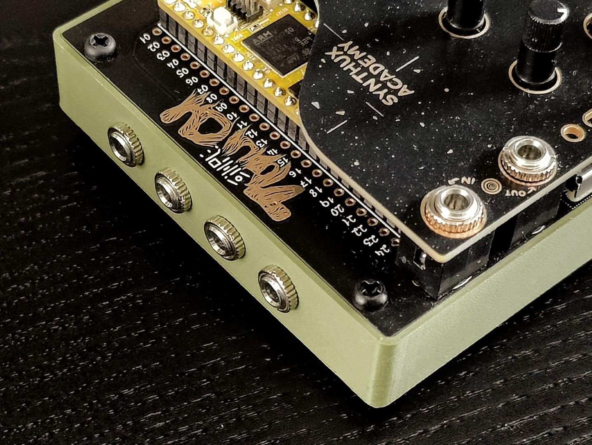
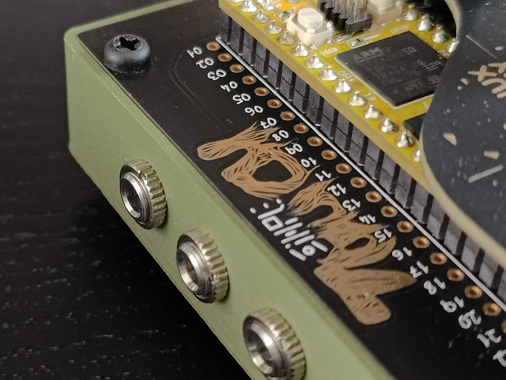
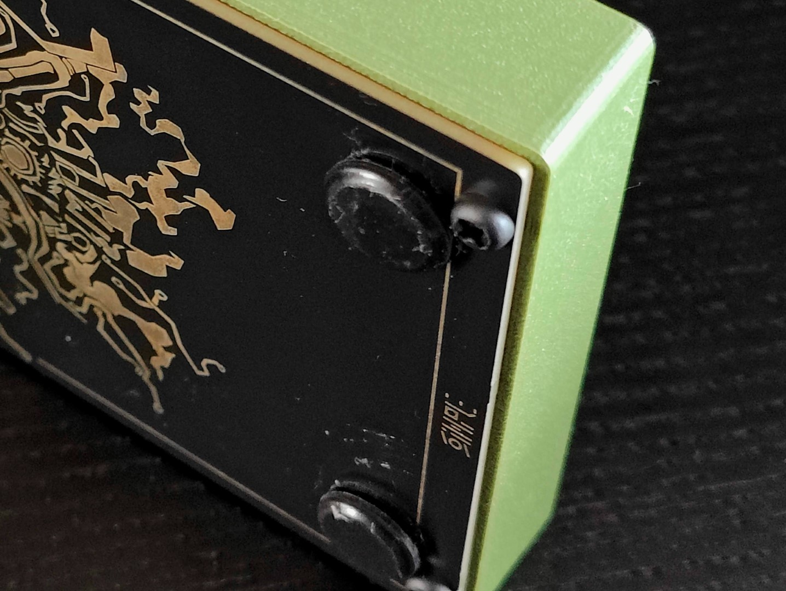
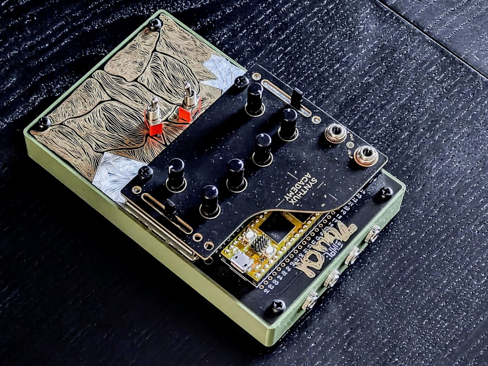
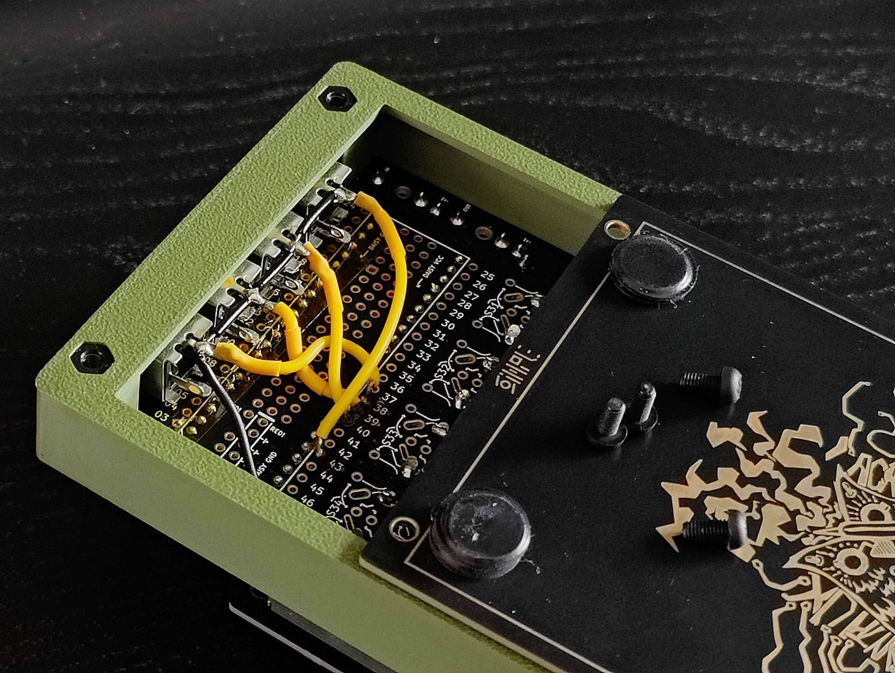
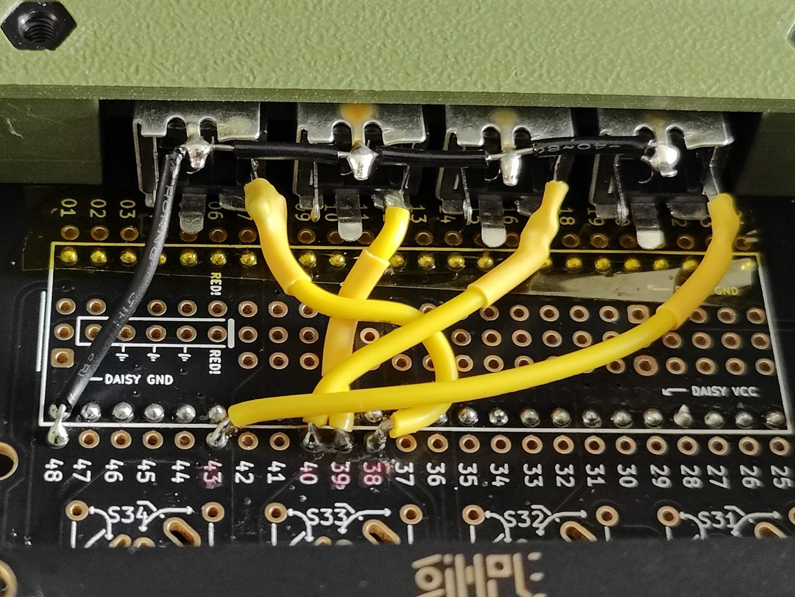
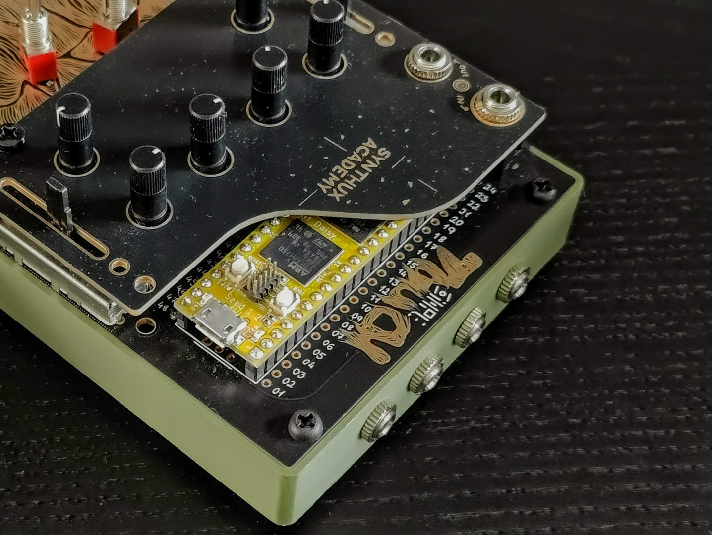

# User submitted case for Simple Touch 2
This case was initially made by another member on the Synthux community on Discord (markotardito). That design in turn was based on a case for Plinky.

I had a mismatch of sizes after trying to alter that design to add more CV inputs on the back. 

I measured the Touch2 with a caliper and redrew the design from scratch in Inkscape and then used Blender to build the 3D shape using boolean modifiers. The blend file is included here. 

STL's were exported from Blender and opened with Microsoft 3D Builder, upon opening they were repaired (made manifold probably) and re-saved.

I've only printed the open back file with the CV cutouts.

For the CV jacks I used the same parts as Synthux includes in some kits. They can be bought at e.g. Thonk: Thonk mono 3.5mm Audio Jacks (PJ301BM) https://www.thonk.co.uk/shop/3-5mm-jacks/

## Instructions to install CV jacks

TODO
I'll add some instructions and pictures here for how to connect the extra CV's to the free analog inputs: numbers 38, 39, 40 and 43 on the Simple PCB (for Daisy Seed)

### **! IMPORTANT !**
#### **_Adding CV to Touch2 without additional circuitry is not going to work._** 
Hop onto the Synthux Discord to learn more or ask around.

If you just connect a jack straight up to the analog pins of Daisy this will work for a clock signal, but it might not be wise to straight up connect these to a higher Voltage Eurorack connections.

I myself have had success with manipulating a PD patch to make an OMX27 send out 3v-ish signals where I'm able to change pitch and send gate.
I got pitch to work only by multiplying the values with a specific value probably only applicable to my setup, and even then the values are rather wonky. **I suppose some sort of logic level shifter or filtering is needed to do this properly, but I've not yet learned this hardware stuff.**

Note that I actually hooked it up illogically, but in code I just reverse/ change the order.

