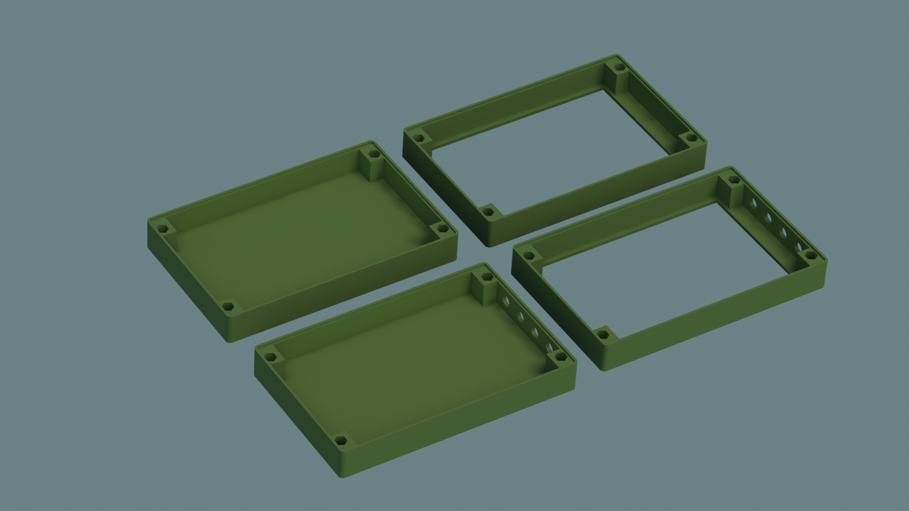
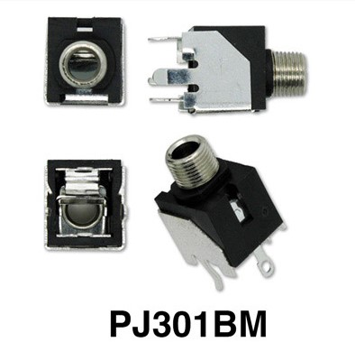

# User submitted case for Simple Touch 2
This case was initially made by another member on the Synthux community on Discord (markotardito). That design in turn was based on a case for Plinky.

I had a mismatch of sizes after trying to alter that design to add more CV inputs on the back. 

I measured the Touch2 and redrew the design first in Inkscape and then used Blender to build the 3D shape. 

STL's were exported from Blender and opened with Microsoft 3D Builder, upon opening they were repaired (made manifold probably) and resaved.

I've only printed the openback file with the CV cutouts.

For the CV jacks I used the same parts as Synthux includes in some kits. They can be bought at e.g. Thonk: Thonk mono 3.5mm Audio Jacks (PJ301BM) https://www.thonk.co.uk/shop/3-5mm-jacks/

## Instructions to install CV jacks

TODO
I'll add some instructions and pictures here for how to connect the extra CV's to the free analog inputs: numbers 38, 39, 40 and 43 on the Simple PCB (for Daisy Seed)
